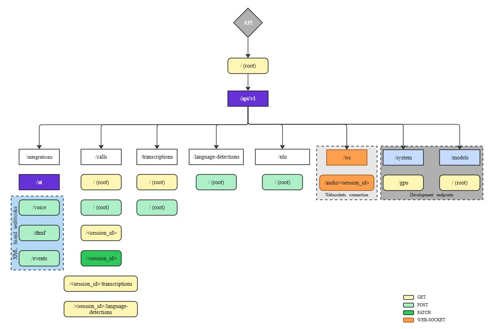

# API Layout 


## Example endpoint

```
POST /api/v1/calls
```
Start a new call session.

**Request Body:**
```json
{
  "phone_number": "string",
  "session_id": "string" (optional)
}
```

```
POST /api/v1/calls/end/{session_id}
```
End an existing call session.

**Query Parameters:**
- `recording_url` (optional): URL to recording
- `escalated` (optional): Whether call was escalated to human

## Response Formats

All API responses are in JSON format.

### Transcription Response Example

```json
{
  "text": "Complete transcribed text",
  "segments": [
    {
      "id": 0,
      "start": 0.0,
      "end": 2.5,
      "text": "Segment text"
    }
  ],
  "performance": {
    "process_time": 1.25,
    "audio_duration": 5.0,
    "real_time_factor": 0.25,
    "device": "cuda:0"
  }
}
```

## Development Tools

Use the `zeipo` cli for common operations:

Ensure you've completed `Setting Up Your Environment` in the 
README.md found in the root directory of this project.

```powershell
# Build zeipo
zeipo build

# Start the API server
zeipo api

# Test GPU access
zeipo gpu

# Run tests
zeipo test

# Help and information
zeipo help
```

## Interactive Documentation

When the API is running, visit `/docs` for interactive API documentation (Swagger UI).