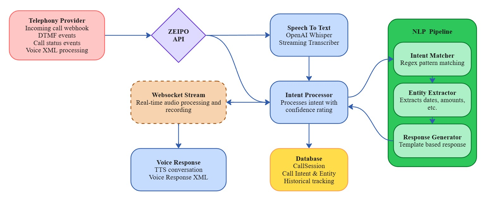

# Zeipo.ai NLU System

The Natural Language Understanding (NLU) system provides a streamlined API interface for processing text inputs within Zeipo.ai's telephony platform. It leverages the core NLP components to understand customer intents and generate appropriate responses.



## Overview

The NLU API endpoint serves as the main interface for text processing, allowing other system components to submit text for intent recognition, entity extraction, and response generation.

## Key Features

- **Simple API Interface**: Straightforward REST endpoint for text processing
- **Session-Based Processing**: Links all NLU operations to call sessions
- **Comprehensive Results**: Returns intents, entities, confidence scores, and generated responses
- **Database Integration**: Automatically stores processing results for analytics

## API Usage

### Processing Text

```http
POST /api/v1/nlu/process
Content-Type: application/json

{
  "text": "I need help with my payment",
  "session_id": "N8hX5XK0V2vj"
}
```

#### Response:

```json
{
  "primary_intent": "PAYMENT",
  "confidence": 0.85,
  "all_intents": [
    {"intent": "PAYMENT", "confidence": 0.85},
    {"intent": "HELP", "confidence": 0.72}
  ],
  "entities": {
    "AMOUNT": ["$50.00"]
  },
  "response": "I can help with payment-related questions. What would you like to know about your payment?",
  "session_id": "N8hX5XK0V2vj",
  "text": "I need help with my payment"
}
```

## Integration with Africa's Talking

The NLU system integrates with Africa's Talking via the webhooks in `src/api/integrations/at.py`. When a call is received:

1. The webhook processes the initial greeting
2. Text is passed to the NLU system for intent detection
3. The generated response is returned as voice XML
4. Subsequent speech is processed through the same pipeline

## WebSocket Integration

For real-time audio processing, the NLU system integrates with the WebSocket streaming interface:

1. Audio is captured via WebSocket at `/api/v1/ws/audio/{session_id}`
2. Speech is transcribed (future implementation)
3. Transcribed text is passed to the NLU system
4. Results are returned via the WebSocket connection

## Implementation

The NLU system is implemented in `src/api/nlu/intent_understanding.py` and exposes a FastAPI endpoint for text processing.

For more detailed information about the NLP components that power the NLU system, please refer to the [NLP README](../nlp/README.md).

## Future Enhancements

1. Support for multi-turn conversations with context
2. A/B testing of different response templates
3. Analytics dashboard for intent distribution
4. Language-specific processing pipelines