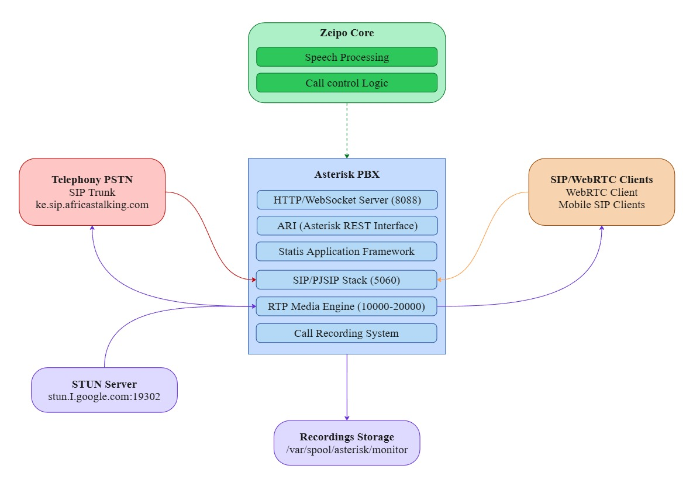

# Zeipo Telephony Layer

This repository contains the SignalWire configuration for Zeipo's telephony layer, providing low-latency voice communication infrastructure for Zeipo AI platform.

## Overview

The Zeipo telephony layer serves as the foundation for voice communication between callers and the core system, responsible for:

- Inbound call routing from SIP trunks
- Call recording and monitoring
- Integration with Zeipo AI via SignalWire's APIs
- Outbound calling capabilities
- WebRTC client connectivity
- Low-latency media processing
- Speech recognition and transcription

## Architecture

The system is built on SignalWire with a focus on event-driven integration. Key components:



1. **SignalWire Platform**: Central platform for voice processing
2. **Event Socket**: Event-driven WebSocket interface for call events
3. **REST API**: HTTP interface for call control and management
4. **SIP Trunking**: Connection to Africa's Talking for PSTN access
5. **RTP Media Engine**: Low-latency voice packet transmission
6. **Call Recording**: Automatic recording for all interactions

## Event Flow & Application Lifecycle

SignalWire uses an event-driven architecture for call handling:

```
User/PSTN ------> SignalWire ------>  Zeipo Core
   ^                 |                     |
   |                 v                     v
   +---- TTS <---- Callback <----- NLU Processing
```

**Event Lifecycle:**

1. **Incoming Call Flow:**
   - SignalWire receives call → Triggers `CHANNEL_CREATE` event
   - `_process_event()` extracts session_id → Calls registered callbacks
   - `_on_call_created()` logs call and creates database record

2. **Speech Recognition:**
   - SignalWire detects speech → Sends `SPEECH_DETECTED` event
   - `_on_call_speech()` processes text through NLU pipeline
   - Intent processor generates response → `speak_text()` delivers it

3. **Webhook Integration:**
   - Browser client sends audio → `websocket_voice_endpoint` processes it
   - `transcript_callback()` fires when STT completes → Triggers NLU
   - Response sent back to client and via SignalWire TTS simultaneously

4. **Callback Registration Pattern:**
   ```python
   provider.register_callback("call.created", _on_call_created)
   provider.register_callback("call.speech", _on_call_speech)
   ```

## Configuration Settings

| Parameter | Purpose |
|------|---------|
| `SIGNALWIRE_HOST` | SignalWire server hostname |
| `SIGNALWIRE_PORT` | API port (default 8082) |
| `SIGNALWIRE_EVENT_PORT` | Event socket port (default 8084) |
| `SIGNALWIRE_USERNAME` | Authentication username |
| `SIGNALWIRE_PASSWORD` | Authentication password |
| `SIGNALWIRE_API_KEY` | API key for REST calls |

## Prerequisites

- SignalWire account with configured project
- Publicly accessible server with static IP
- SIP trunk account with Africa's Talking
- Open ports:
  - 5060 (SIP)
  - 8082 (HTTP/WebSocket API)
  - 8084 (Event Socket)
  - 16384-16484 (RTP media)

## Installation

SignalWire is pre-configured in the Docker container. 
Find its config files in the `.env` file.

## Usage

### Accessing the Zeipo AI System

Users can access the Zeipo AI system through:

1. **Direct Dial**: Calling a number provisioned on Africa's Talking or SignalWire
2. **WebSocket**: Connecting via `/api/v1/telephony/voice/ws` endpoint
3. **WebRTC**: Connecting via web client

### Outbound Calling

Make outbound calls through the API:

```
POST /api/v1/telephony/outbound
{
  "phone_number": "+1234567890",
  "caller_id": "Zeipo AI",
  "say_text": "Hello from Zeipo AI"
}
```

### Testing and Debugging

Monitor active calls:
```bash
# View logs
docker logs zeipo-signalwire

# Test API connection
curl -v "http://localhost:8082/api/v1/calls" -u "zeipo:your_password"
```

## Development

### Connecting with SignalWire

The Zeipo AI application connects to SignalWire using WebSockets:

```python
# Event listening
self.ws_url = f"ws://{settings.SIGNALWIRE_HOST}:{settings.SIGNALWIRE_EVENT_PORT}"
self.event_thread = threading.Thread(target=self._event_loop_runner, daemon=True)
self.event_thread.start()

# API requests
self.base_url = f"http://{settings.SIGNALWIRE_HOST}:{settings.SIGNALWIRE_PORT}/api/v1"
response = requests.post(f"{self.base_url}/calls", json=request_data, auth=self.auth)
```

### Call Flow

1. Incoming call arrives via SIP trunk
2. SignalWire sends CHANNEL_CREATE event via WebSocket
3. Zeipo AI application receives event and creates call session
4. Application sends response with welcome message and speech recognition
5. Speech is processed through NLU pipeline
6. Responses are sent back via TTS
7. Call is recorded throughout the conversation

## Troubleshooting

| Issue | Possible Resolution |
|-------|------------|
| Event Socket Failures | Check WebSocket connection and authentication |
| Trunk Registration Issues | Verify Africa's Talking credentials in SignalWire |
| One-way Audio | Check NAT settings and STUN server access |
| High Latency | Review codec selection and RTP configuration |
| Call Recording Failures | Check directory permissions and disk space |

## Low Latency Optimizations

This configuration is optimized for low latency voice:

- Standard ulaw/alaw codecs for reliable, low-latency audio
- ICE/STUN for optimal media path selection
- WebSocket keep-alive settings tuned for responsiveness
- Speech recognition configured for real-time response

## Integration with Other Zeipo Components

The telephony layer integrates with other Zeipo systems:

- **Speech Recognition**: Call audio is processed by SignalWire and Whisper
- **NLP/NLU**: Text from speech recognition is processed to determine intent
- **AI Application**: Controls call flow based on recognized intents

For more details on these components, refer to their respective repositories:
- [API Integration](../api/README.md)
- [NLP System](../nlp/README.md)
- [NLU System](../nlu/README.md)

## License

Copyright © 2025 Zeipo.ai - All Rights Reserved